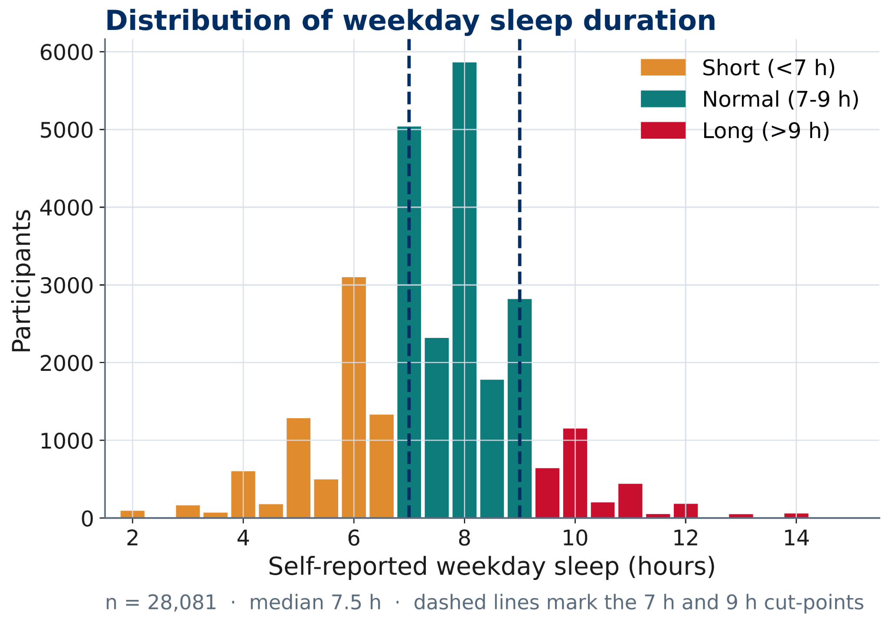
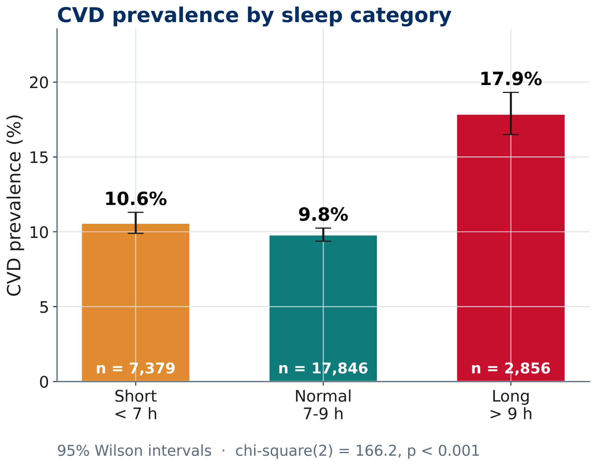
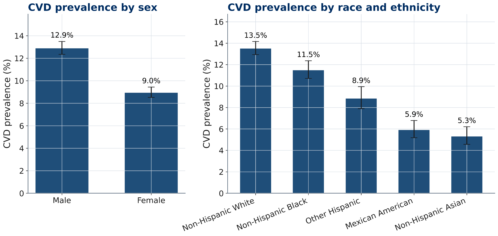
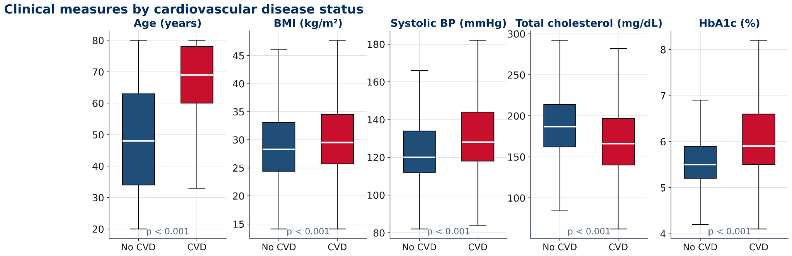
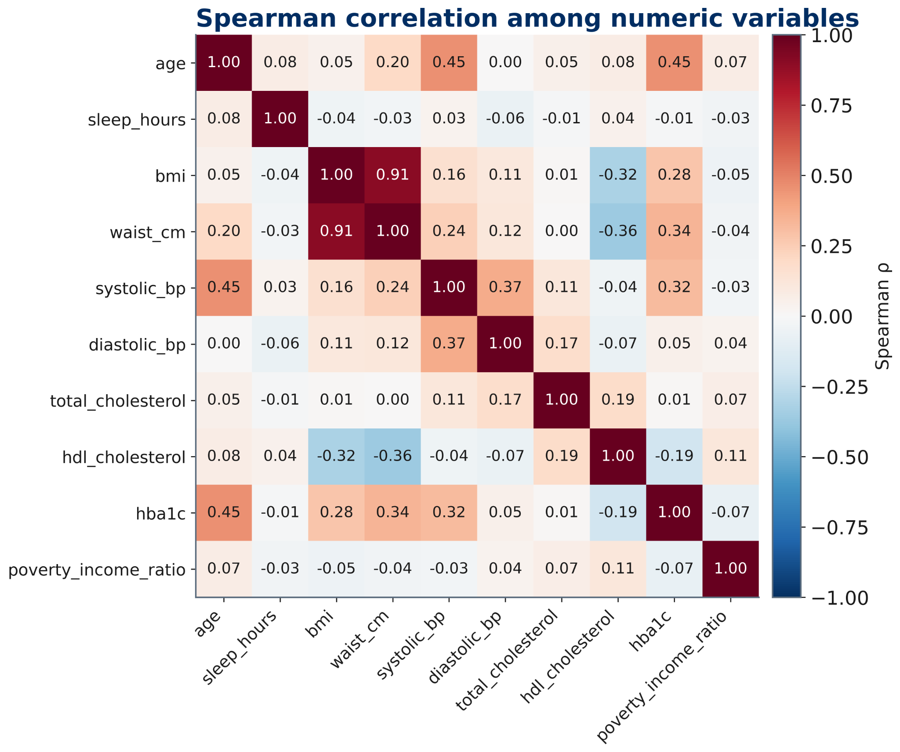
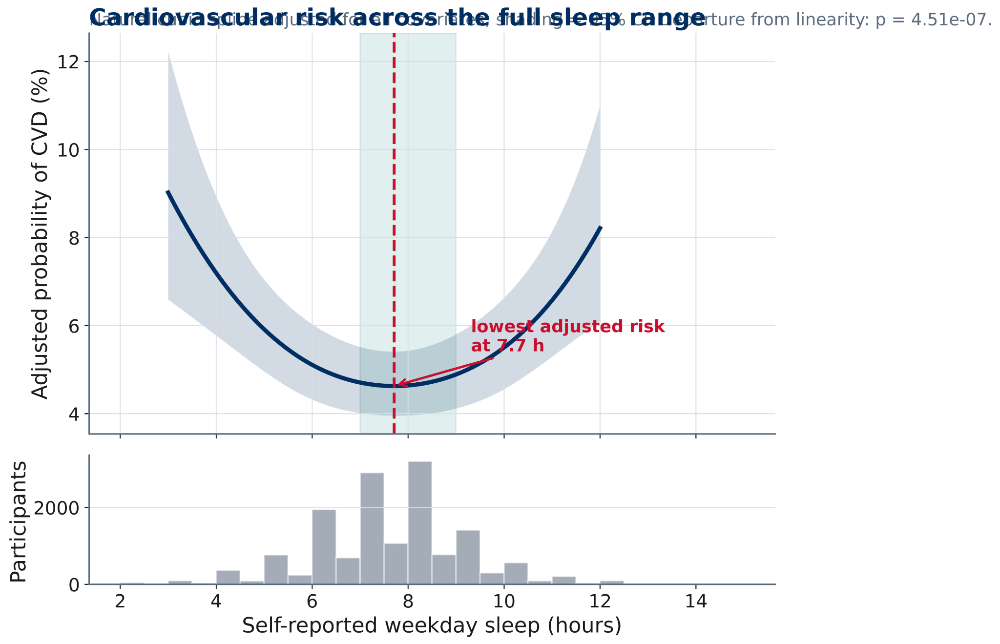
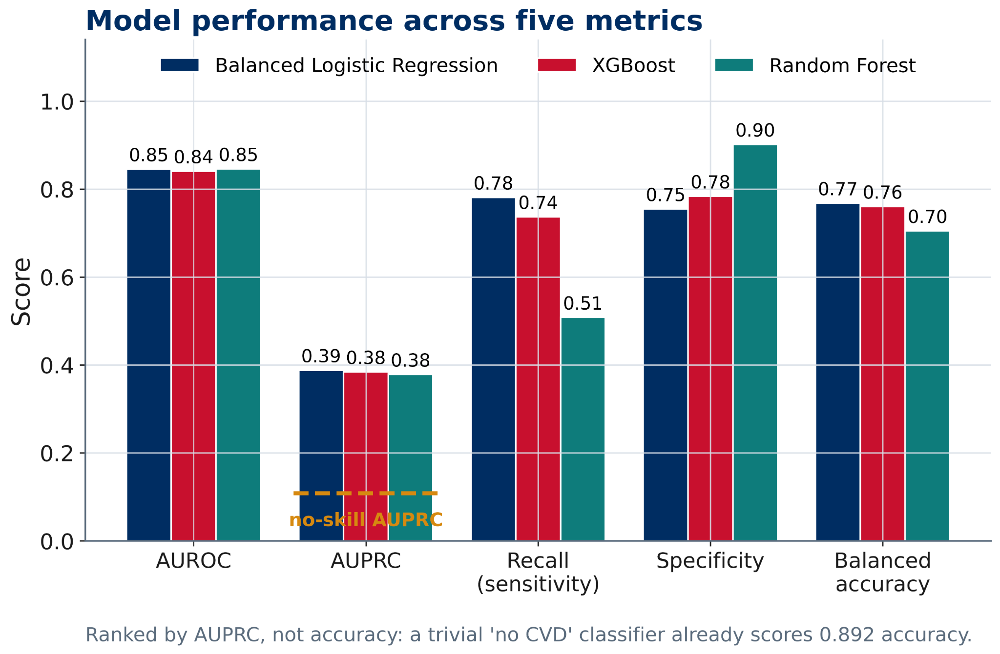
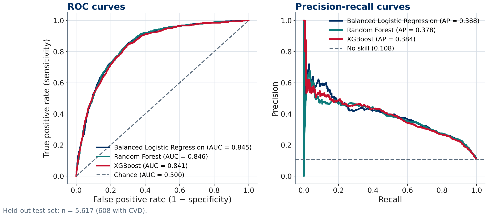
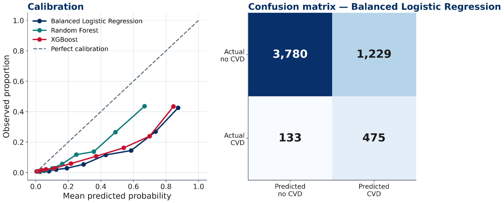
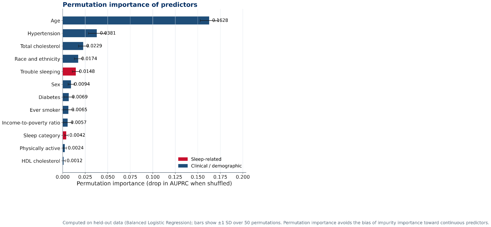

# Figure index

## Sleep Duration Distribution

## Cvd Prevalence By Sleep Category

## Cvd Prevalence By Sex And Race

## Clinical Measures By Cvd Status

## Spearman Correlation Matrix

## Sleep Cvd Dose Response

## Model Performance Metrics

## Roc And Precision Recall Curves

## Calibration And Confusion Matrix

## Permutation Feature Importance

